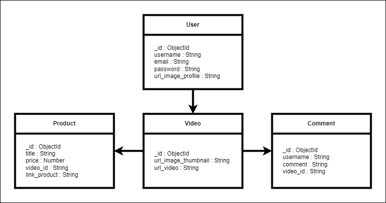

# Tokopedia Play Clone

## Database Structure



## API Structure

## List API Request and Response

### Model

- Video

      {
        "id": "string"
        "url_image_tumbnail": "string",
        "url_video": "string",
        "created_at": datetime(iso 8601),
        "updated_at": datetime(iso 8601),
      }

- Product

      {
        "id": "string",
        "title": "string",
        "price": "number",
        "video_id": "string",
        "link_product": "string"
        "created_at": datetime(iso 8601),
        "updated_at": datetime(iso 8601),
      }

- Comment

      {
        "id": "string",
        "username": "string",
        "comment": "string",
        "video_id": "string",
        "created_at": datetime(iso 8601),
        "updated_at": datetime(iso 8601),
      }

### Endpoint

- Video
  - `POST /v1/api/videos` : create video
  - `GET /v1/api/videos` : get list videos
  - `GET /v1/api/videos/:id` : get a video by id
  - `GET /v1/api/videos/:id/products` : get a video by id and all products
  - `GET /v1/api/videos/:id/comments` : get a video by id and all comments
- Product
  - `POST /v1/api/products` : create product
  - `GET /v1/api/products` : get list products
  - `GET /v1/api/products/:id` : get a product by id
- Comment
  - `POST /v1/api/comments` : create comment
  - `GET /v1/api/comments` : get list comments
  - `GET /v1/api/comments/:id` : get a comment by id

### Success Response

- Video
  ```json
  {
    "code": 200,
    "message": "ok",
    "data": [
      {
        "id": "contohid1234",
        "url_image_tumbnail": "http://tokopedia.com",
        "url_video": "http://youtube.com"
      }
    ]
  }
  ```
- Product
  ```json
  {
    "code": 201,
    "message": "OK",
    "data": {
      "title": "imageTumb",
      "price": 90000,
      "video_id": "64c26c03027cdaee50dd0378",
      "link_product": "hasdkahjs",
      "_id": "64c28e5e237f06ca94a2d765",
      "createdAt": "2023-07-27T15:33:50.321Z",
      "updatedAt": "2023-07-27T15:33:50.321Z"
    }
  }
  ```
- Comment
  ```json
  {
    "code": 200,
    "message": "ok",
    "data": [
      {
        "id": "contohid1234",
        "username": "alexia",
        "comment": "Barangnya bagus",
        "video_id": "64c26c03027cdaee50dd0378",
        "createdAt": "2023-07-27T15:33:50.321Z",
        "updatedAt": "2023-07-27T15:33:50.321Z"
      }
    ]
  }
  ```

## How to install and Run the App

1. Pastikan Anda sudah menginstal Node.js dan npm di sistem Anda.
   ```bash
   npm i
   ```
2. Clone repositori ini ke dalam folder lokal Anda.
   ```bash
   git clone https://github.com/NisaCipta/MID-GIGIH.git
   ```
3. Buka terminal atau command prompt, lalu arahkan ke folder repositori yang sudah di-clone.
   ```bash
   cd MID-GIGIH
   ```
4. Jalankan perintah berikut di terminal
   ```bash
   npm run start
   ```
5. Buka postman dan jalankan http://localhost:3000/v1/api/
